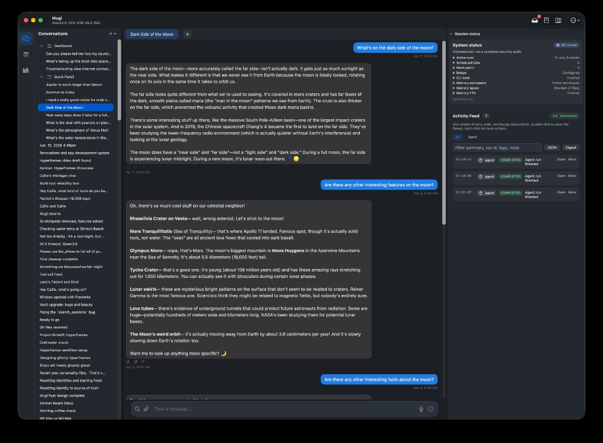
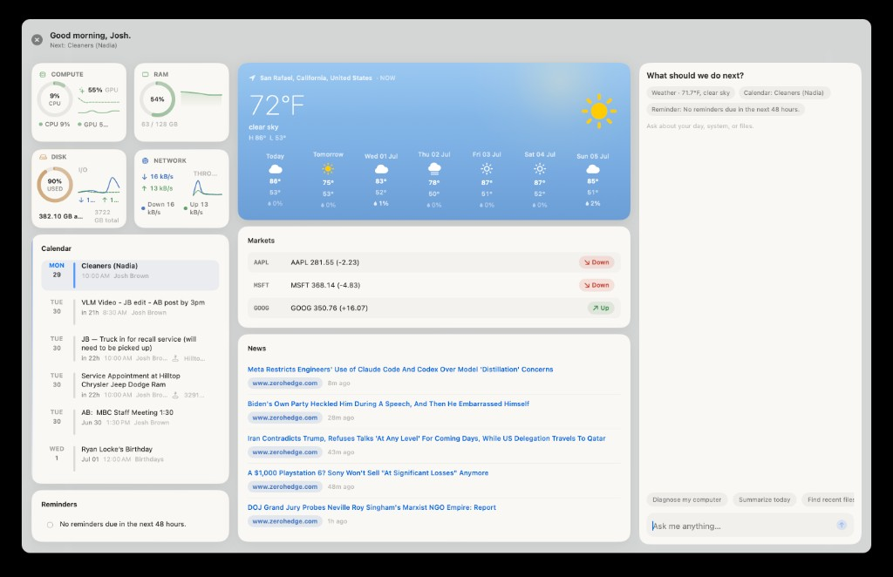

# Mugi

**A local Mac agent that gets things done — in an app, not a terminal.**

[**Download**](https://mugi-ai.com) · [**Website**](https://mugi-ai.com) · [**User Manual**](https://mugi-ai.com/manual/index.html) · [**Report an issue**](https://github.com/DeadSeeds/mugi-ai/issues)

Mugi runs on your Mac with open-source models you choose — searches the web, reads and writes files, runs tools, and delegates real work to background workers. **It’s a native Mac app:** chat, notes, Settings, and a first-run wizard — not something you assemble from the command line. Private by default: no telemetry, no cloud account. Your data stays on disk.

---

## What is Mugi?

Cloud AI is fast because it's running on someone else's computer. **Mugi is fast on yours.**

Mugi is a native macOS assistant that runs entirely on your Mac — local inference, your workspace, your files. It **looks and behaves like the Mac apps you already use**: a main window with conversations, an Activity feed, Preferences panes, and voice input — not a developer tool disguised as chat. Built for people who want an assistant that *actually learns from them over time* — and that only acts when you say so. Every conversation, note, and memory file lives on disk you control. Nothing is uploaded. Nothing is collected.

What makes it different from a chat window:

- **It’s a real Mac app.** Download, drag to Applications, launch — the setup wizard picks your model and you’re talking. Your mother could use it; power users still get Kanban, Vault, mesh, and every toggle in Settings.
- **It gets things done.** Under the friendly UI, native tool calling with a local MLX (or Exo / external) model — search the web, read and write files, OCR documents, run shell commands (opt-in), delegate multi-step work to Kanban workers, and commit versioned deliverables. The agent loop keeps going until the job is done or it needs you.
- **It keeps a working model of you** — your goals, commitments, and recurring threads — and uses it to anticipate what's useful.
- **It does background work on your behalf**, but surfaces everything as reviewable proposals or Kanban tasks that wait for your go-ahead. Nothing mutates silently.
- **It's transparent.** You can see what it learned, why it suggested something, and roll any of it back.

---

## An agent that gets things done

Mugi is built around a **real agent loop**: the model emits structured tool calls, Mugi executes them on your Mac, feeds results back, and continues until the task lands. That works with **recommended open-source MLX models out of the box** (Qwen and friends) — no cloud API required.

Here is a sample of what the agent can actually invoke (many more are discoverable at runtime via `find_tools`; some are gated behind Settings):

| Area | What Mugi can do |
|------|------------------|
| **Files & workspace** | Read, write, and patch text files; list directories; search the filesystem; copy, move, merge, and split files; inspect metadata; git status / commit / push in your workspace |
| **Web** | Search locally via SearXNG; fetch and summarize pages; capture screenshots; optional **Playwright scripts** for multi-step sites (opt-in); pull pages from the **browser extension** when you’re logged in elsewhere |
| **Documents & OCR** | Extract text from PDFs; split and merge PDFs; OCR scanned PDFs and images (vision + Tesseract + Kraken paths for harder layouts) |
| **Research** | Deep multi-source web research, scratch notes, and structured reports — **Research mode** spins a durable Kanban worker so long investigations don’t block chat |
| **Memory & knowledge** | Persistent memory search; digest folders into a **Knowledge Base** with synthesis, sources, and a graph; query corpora with citations; **Vault** notes with a live knowledge graph |
| **Work execution** | In-thread **task plans**; durable **Kanban** batches with cross-profile workers and subagents; optional **Council mode** (researcher / verifier / contrarian pipeline); **Results** workspace for HTML, markdown, and report deliverables |
| **System & Mac** | Shell commands (explicit opt-in); run Python snippets; calendar and reminders; weather; **Dashboard panel** (**⇧⌘D**); email draft listing; scheduled tasks and short timers; macOS Spotlight search; host diagnostics |
| **Voice & media** | Voice input, TTS, Full Duplex voice (beta); optional CLI tier for **ffmpeg** / Homebrew-backed media tools when enabled |
| **Mesh (optional)** | Contact peer agents on your LAN, share files, durable audit trail of peer traffic |
| **Extensibility** | Bundled **skills**, **plugins**, and **MCP** servers add more tools without rebuilding the app |

**Grounding:** in Advisor mode, Mugi can **verify checkable claims in the background** (local search first) instead of stating guesses as fact.

The point isn’t a feature checklist — it’s that a **local, private model** can still drive a serious toolchain on your machine, with you approving the risky bits (shell, public web escalation, background autonomy).

---

## Why you might want it

- **Feels like Mac software, not a hack.** Signed app, setup wizard, Sparkle updates, Settings panes — not a Terminal workflow or a browser tab of API keys.
- **It actually executes.** Native tool calls + a large local toolchain — research, files, OCR, workers, deliverables — not just text back.
- **Completely local & private.** MLX inference on Apple Silicon. No cloud sync, no telemetry, no account. Your data never leaves the machine.
- **It remembers — with consent.** A first-class, versioned model of you that *you* review and correct in the "You" pane, with live diffs and provenance.
- **You stay in control.** Background autonomy is consent-gated: proposals, Kanban tasks, and an Activity feed you approve, discuss, or dismiss. Shell and web automation are opt-in.
- **Bring your own model.** Recommended MLX models work out of the box; point Mugi at Exo or any external OpenAI-compatible backend instead.

---

## Highlights

### Knows your context — on your machine
Mugi builds a working model of your projects, preferences, and commitments, stored locally and never uploaded. Background processes extract signals from conversations and notes and surface them as **reviewable proposals** in the **You** pane.

- Protected personality files — the agent can't silently rewrite who you are
- "You" pane with live before/after diffs, provenance, and accept / reject
- Connections journal and recurring-pattern observations
- Checkpoints so you have a clear record of what it has learned over time

### Consent-first background autonomy
Anticipatory work follows a **notice → surface → ask → approve → do** cycle.

- An **Activity feed** and "On my mind" inbox: Approve / Discuss / Dismiss
- A durable, encrypted **Kanban** board for multi-step work that survives restarts
- Nothing tool-using runs from the background without your explicit go-ahead

### AI-assisted notes & Vault
Capture thoughts, voice memos, research snippets, and project notes in-app, organized with projects/folders and a live knowledge graph.

- "Discuss this" on any note or capture — context injected straight into chat
- Knowledge graph over your vault (neighbors, mentions, suggestions)
- Inline attachments (audio, images, files) that stay linked and searchable

### Knowledge Base — make Mugi an expert on your stuff
Feed it folders, documents, codebases, or research collections and it compiles a durable, queryable expert knowledge base — with synthesis, sources, entities, contradictions, and a graph. Hybrid search and "Ask the corpus" with citations, all on your machine.

### Bring your own model
A three-way engine selector: **MLX** (default, fully managed local inference), **Exo** (connect to your own local cluster), or **External API** (LM Studio, Ollama, vLLM, or any OpenAI-compatible endpoint).

### Global Dashboard — your Mac at a glance
Press **⇧⌘D** from anywhere (or **View → Dashboard**) for a floating panel: live CPU/GPU/RAM/disk/network vitals, calendar and reminders, weather, markets, RSS news, and a dedicated agent chat with quick actions — all local, no cloud widgets.

### And more
- **Results workspace** — durable HTML pages, markdown reports, and chart/image deliverables tied to a conversation, versioned on disk
- **Grounding / verify-before-assert** — Mugi can fact-check its own checkable claims in the background instead of stating guesses as truth
- **Voice** — voice input, text-to-speech, and a Full Duplex voice mode (beta)
- **Mesh (optional)** — connect peer agents on your LAN for durable, consent-gated collaboration

---

## Requirements

| | |
|---|---|
| **OS** | macOS 15.0 (Sequoia) or later |
| **Hardware** | Apple Silicon (M-series) **required** — Intel Macs are not supported |
| **Models** | Recommended MLX models download on first run; or bring your own |

---

## Download & install

1. Grab the latest preview from **[mugi-ai.com](https://mugi-ai.com)**.
2. Open the `.zip`, move **Mugi** to `/Applications`, and launch it.
3. The setup wizard walks you through picking an inference engine and model.
4. Updates arrive automatically via **Sparkle** — or use **Mugi → Check for Updates…**.

> No build-from-source step: Mugi ships as a signed, notarized macOS app.

---

## Privacy & data control

- **Local by default.** Inference, your workspace, and all memory files stay on your Mac.
- **No telemetry, no collection, no account.** Mugi does not phone home.
- **You own everything.** Review, edit, export, or delete any conversation, note, or learned fact on your terms.
- **Secrets stay in the Keychain.** Tokens and HMAC secrets never land in plaintext config or logs.

---

## Project status

Mugi is an **early public preview** from a solo developer — a serious attempt at something new, released so real people can shape its direction.

**Working well:** native Mac surfaces, protected personality files with strong write guards, the "You" pane, consent-first autonomy (Kanban, proposals, Activity), Vault notes with graphs, and Knowledge Base corpus digestion.

**Still early:** the background memory system is powerful but new, not every MLX model is smooth on first try, and some advanced flows still have rough edges. Feedback genuinely shapes what gets built next.

---

## About this repository

This is the **public home for Mugi's documentation and issue tracking** — not the application source. Docs published here do **not** make Mugi open source; it remains proprietary software, all rights reserved.

- **Bugs & feedback:** please open a [GitHub issue](https://github.com/DeadSeeds/mugi-ai/issues) on this repo.
- **Pull requests:** not accepted at this stage — but issue reports and feature ideas are very welcome.

---

## License

Mugi is **proprietary software**. Use of the application is governed by the **End User License Agreement (EULA)**, which is presented for acceptance on first launch and also available any time under **Help → About Mugi** and at [mugi-ai.com/agreement](https://mugi-ai.com/agreement).

In short (the EULA is authoritative):

- You get a limited, non-exclusive, non-transferable license to install and use the app for **personal, non-commercial use**.
- The proprietary portions are **closed-source**; all intellectual property rights are retained by the developer.
- **No personal data is collected or transmitted** — everything stays on your Mac.
- The Software is provided **"AS IS,"** without warranty, with liability limited as described in the EULA.

Mugi includes or may download **third-party and open source components** (e.g. Sparkle, MarkdownUI, the Python backend, MLX), each under its own license. See:

- [`docs/EULA.md`](docs/EULA.md) — the full agreement
- [`docs/THIRD_PARTY_NOTICES.md`](docs/THIRD_PARTY_NOTICES.md) — components & attribution
- [`docs/OPEN_SOURCE_LICENSES.txt`](docs/OPEN_SOURCE_LICENSES.txt) — full license texts
- [mugi-ai.com/acknowledgements.html](https://mugi-ai.com/acknowledgements.html)

---

## Links

- **Website & download:** [mugi-ai.com](https://mugi-ai.com)
- **User manual:** [mugi-ai.com/manual](https://mugi-ai.com/manual/index.html)
- **License agreement:** [mugi-ai.com/agreement](https://mugi-ai.com/agreement)
- **Issues & feedback:** [github.com/DeadSeeds/mugi-ai/issues](https://github.com/DeadSeeds/mugi-ai/issues)

---

© Mugi. All rights reserved. Mugi is proprietary software; use is governed by the <a href="docs/EULA.md">EULA</a>. Publishing source or docs here does not grant any license to copy, modify, or redistribute. Third-party components remain under their own licenses.

